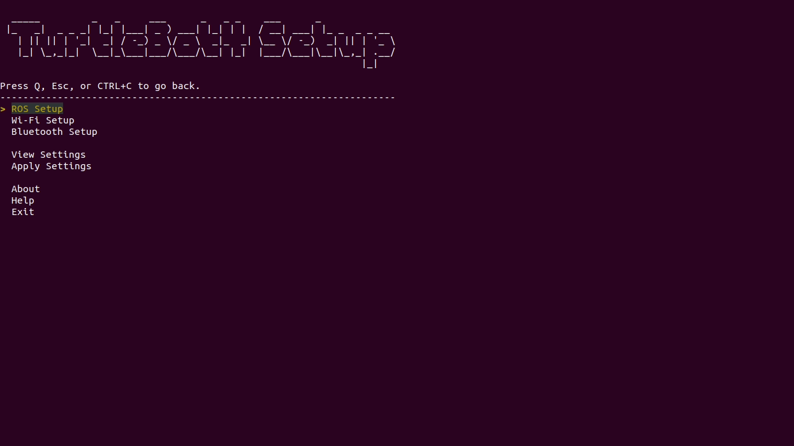

# Procedimentos Iniciais para Configuração do Turtlebot4

## Configuração de Rede

Seguindo a documentação descrita em [Basic Setup](https://turtlebot.github.io/turtlebot4-user-manual/setup/basic.html), deve-se realizar a configuração de rede do Turtlebot4. 

### Procedimento:

1. Conectar o robô na base e ligá-lo.
2. Conectar o computador na rede do robô `Turtlebot4` cuja senha é também `Turtlebot4`
3. Conectar no IP Default do robô(visualização do IP no monitor do robô) via ssh:
    ```bash
    ssh ubuntu@10.42.0.1
    ```
4. Conectar o robô à rede local com conexão de internet seguindo o gif abaixo:
    ```
    turtlebot4-setup
    ```
- Por exemplo: Utilizou-se a rede local: `miss_5G` cuja senha é `pmecathome`, cujo roteador está presente no laboratório PixelLab(INF/UFG)
<div align="center">



</div>

5. Após realizado esse procedimento, a RaspiberryPi 4b irá reiniciar e o novo IP será exibido no monitor do robô, sendo neste caso: `192.168.1.106`, neste caso.

## Atualização do Sistema 

Após a configuração de rede, realiza-se a atualização do sistema operacional do Turtlebot4.

```bash
    ssh ubuntu@192.168.1.106
```
A senha ainda é a mesma `turtlebot4`.

```bash
    sudo apt update && sudo apt upgrade
```

Seguindo as operações padrão durante esse processo, o sistema necessitará ser reiniciado: 

```bash
    sudo reboot
```
