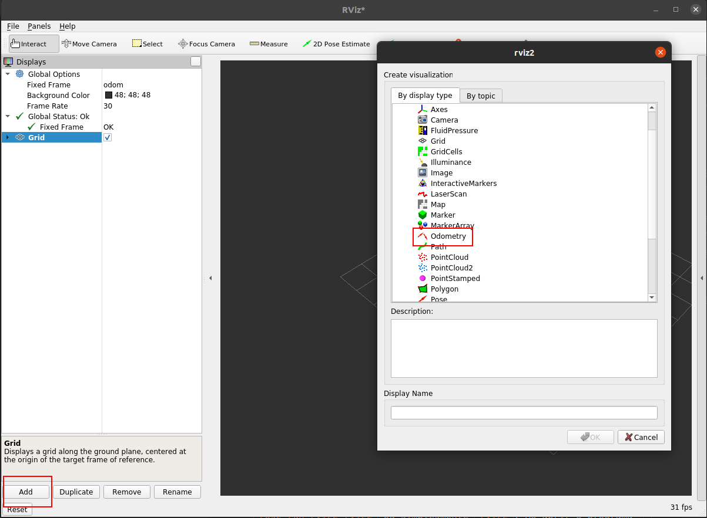

# Fusão sensorial com filtro de Kalman extendido

## 1. Instruções gerais

Neste laboratório vocês devem implementar o Filtro de Kalman Extendido para fazer a fusão sensorial dos dados provenientes de um odômetro e de um sensor inercial (IMU) para estimar a posição e orientação do robô albot. Diferente do exemplo visto em sala de aula este robô não possui dados de GPS a estimativa deve ser baseada apenas nos dados de velocidades angulares e velocidades lineares medidos pelos sensores citados anteriormente.

Deste modo, o nosso robô possui um vetor de estado $\textbf{x}_t=[x_t, y_t, \phi_t, v_t]$ e um vetor de controle de entrada $\textbf{u}_t=[v_t, \omega_t]$ dados pelo o sensor de odometria das rodas e o sensor inercial. 

Para a implementação utilizem o modelo de movimento baseado em velocidade visto em sala de aula:

$$
\begin{equation} \begin{bmatrix} x' \\ y' \\ w' \\ v' \end{bmatrix} = f(\textbf{x}, \textbf{u}) = \begin{bmatrix} x + v\cos(\phi)\Delta t \\ y + v\sin(\phi)\Delta t \\ \phi + \omega \Delta t \\ v \end{bmatrix} \end{equation}
$$

## 2. Instruções de implementação

### 2.1. Arquivo bag
Para facilitar o desenvolvimento do algoritmo sem a necessidade de rodar o simulador vocês vão utilizar a ferramenta `ros2 bag`, a documentação está [aqui](https://docs.ros.org/en/foxy/Tutorials/Beginner-CLI-Tools/Recording-And-Playing-Back-Data/Recording-And-Playing-Back-Data.html). A ferramenta permite salvar dados dos tópicos criando um dataset para que os experimentos e testes sejam reproduzidos.

O arquivo encontra-se na pasta bag e para executa-lo basta rodar o comando `ros2 bag play rosbag2_2023_06_30-13_04_47_0.db3`.

Caso necessário instalem o pacote:
```
sudo apt-get install ros-$ROS_DISTRO-ros2bag \
                     ros-$ROS_DISTRO-rosbag2-converter-default-plugins \
                     ros-$ROS_DISTRO-rosbag2-storage-default-plugins
```

### 2.1.2. Tópicos
Como dito anteriormente para a implementação vocês devem utilizar os dados provenientes do odômetro e do IMU, este dados podem ser obtidos inscrevendo nos tópicos `/odom` e `/imu/data`, respectivamente.

**Atenção**: Esses sensores publiquem dados em frequências diferentes diferente do exemplo visto em sala de aula em que tinhamos um $\Delta_{t}$ de $0.1$ segundos para todos os sensores. 

Para saberem a frequência de publicação de cada sensor podem utilizar o comando `hz` do `ros2 topic` (ex: `ros2 topic hz /odom`).

### 2.1.2. Saída
A saída do algoritmo deve ser algo próximo a figura abaixo


Vocês podem salvar os dados de saida do filtro e plotar utilizando ferramentas do python ou podem visualizar a saída utilizando o pacote `rviz2`.

Para visualizar no `rviz2` vocês precisam publicar uma mensagem do tipo [Odometry](https://docs.ros2.org/foxy/api/nav_msgs/msg/Odometry.html). 

```
def __init__(self):
        super().__init__('ekf_odometry')
        self.publisher_ = self.create_publisher(Odometry, 'ekf/odom', 10)

def publish_odometry(self, x, y, z, quat_x, quat_y, quat_z, quat_w):
    msg = Odometry()
    msg.header.stamp = self.get_clock().now().to_msg()
    msg.pose.pose.position.x = x
    msg.pose.pose.position.y = y
    msg.pose.pose.position.z = z
    msg.pose.pose.orientation.x = quat_x
    msg.pose.pose.orientation.y = quat_y
    msg.pose.pose.orientation.z = quat_z
    msg.pose.pose.orientation.w = quat_w
    self.publisher_.publish(msg)
```

**Atenção:** A orientação yaw do filtro vai ser em euler, para publicar a mensagem do tipo Odometry vão precisar converter para quaternion para isso podem utilizar a biblioteca tf:

```
apt install ros-$ROS_DISTRO-tf-transformations

import tf_transformations
q = tf_transformations.quaternion_from_euler(roll, pitch, yaw)
```

Para abrir o `rviz2` vocês podem rodar o comando `ros2 run rviz2 rviz2` ou simplesmente `rviz2`. Ao abrir o programa vocês devem adicionar um tópico do tipo `Odometry`, alterar o `Fixed Frame` para `odom` e adicionar o tópico com o nome que vocês definirem.

**Atenção:** não utilizem o nome `odom` para o topico de vocês porque já está sendo utilizado por outro tópico, podem utilizar o nome `ekf/odom`.




